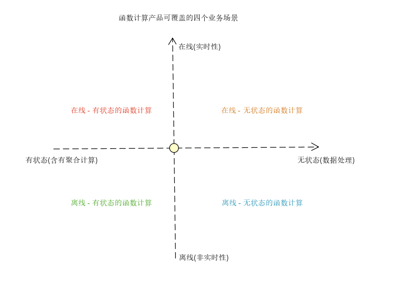
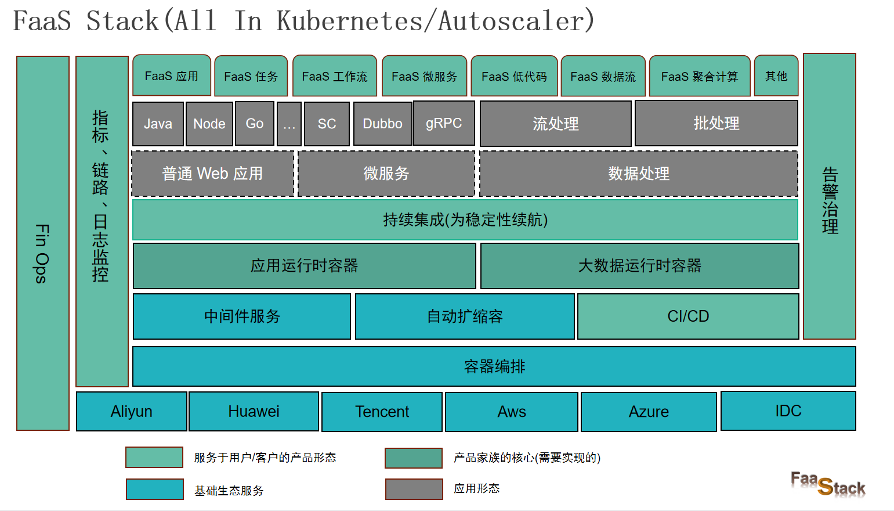

## 背景

随着这几年 Serverless 的字眼逐渐占据着各大网站的头条，各个云厂商和一些互联网公司开始积极探索和完善这块的基础化设施能力，衍生出了一些非常有活力的云产品和公司。
本文作者(花名: 得少)所经历的两家公司，有幸见证了两款产品从 0 到 1 的开发与落地。这两年来也一直围绕 Serverless 架构下的产品研发， 和我的组长一起主导和设计
了两款产品: 函数计算和应用级别的 Serverless 。这两款产品已经在线上稳定运行两年多，当前平台托管的函数集群占用的资源占整体的 1/4(7000+核 4T 内存)，基于函数计
算的数据处理条数达到每日 430 亿(tps 百万数量级)。

在这个过程中我们基于 KNative 来建设 Serverless 化的 FaaS 产品能力，走过不少的弯路，也积累了不少的经验，本着 IT/软件技术共享开放的原则，将个人在 FaaS 这一
块的思考和经验跟大家一起分享，分享的过程中如果你有自己的想法欢迎一起探讨和交流。

## 国内外发展现状(大事迹)

- 2012 年: Serverless 一词最早是**由 Ken Form 在 2012 年**提出的，源自[Why The Future Of Software And Apps Is Serverless](https://readwrite.com/why-the-future-of-software-and-apps-is-serverless/) ，
- 2014 年: 而 Serverless 化的产品(由 AWS 为代表的 Lambda)最早确是由 AWS 在 2014 年推出的。
- 2017 年: 3 年后，时间大概来到了 2017 年，国内各个云厂商开始在这个赛道进行布局，更进一步加快了 Serverless 产品化落地的进程。
- 2018 年: Google 开源 Serverless 框架: KNative, 同年 Gartner 将 Serverless 列为十大影响基础设施和运维的技术趋势之一。

从这个历程可以看出从诞生到现在(2023 年)已经走过了 11 年，国内有 Serverless 这一块的研发与落地经验时长最多的为 6 年(2017 - 2023)。 我大概是在 2021 年4月份开始
在这个领域进行探索和实践，并且设计和开发了当前两款 Serverless 化的产品:
- 函数计算: 基于函数计算的弹性数据处理平台。
- 弹性后端(微)服务: 应用级别让 http 、rpc 服务运行时具有弹性。

## 项目的目标和整体的规划

### 函数计算的设计目标(四种场景下的解决方案)

函数计算这部分的目标，在计算处理过程中是有状态还是无状态、是否对处理延时的敏感性两个维度有四个场景的问题需要解决，如下所示:

### 整体的规划

